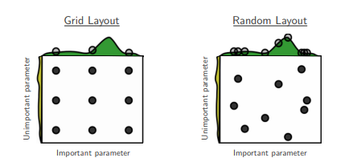

# 自动调参方法
常用的自动调参方法主要分为两类: **简单搜索方法**和**基于模型的序贯优化方法**.

## 简单搜索方法
简单搜索方法指的是一些通用的, 朴素的搜索策略. 常用的方法主要包括: 随机搜索(Random Search)和网格搜索(Grid Search).

随机搜索采用随机的搜索方式生成数据点, 由于完全随机, 随机搜索效果并不稳定, 但也不会陷入最优, 当不对随机搜索次数做限制时, 会产生令人意想不到的效果.

网格搜索则会遍历用户设置的所有数据点, 由于用户配置的网格点之间是有间隙的, 因此, 网格搜索很可能会遗漏一些优异样本点, 网格搜索的效果完全取决于用户的配置.

如图所示, 当最优超参配置存在于网格的间隙中时, 通过网格搜索无法得到最优配置, 而通过随机搜索却有一定可能.

## 基于模型的序贯优化方法

基于模型的序贯优化方法(SMBO, Sequential Model-Based Optimization)是一种贝叶斯优化的范式. 这类优化方法适合于在资源有限的情况下获得较好的超参数.

