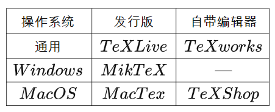
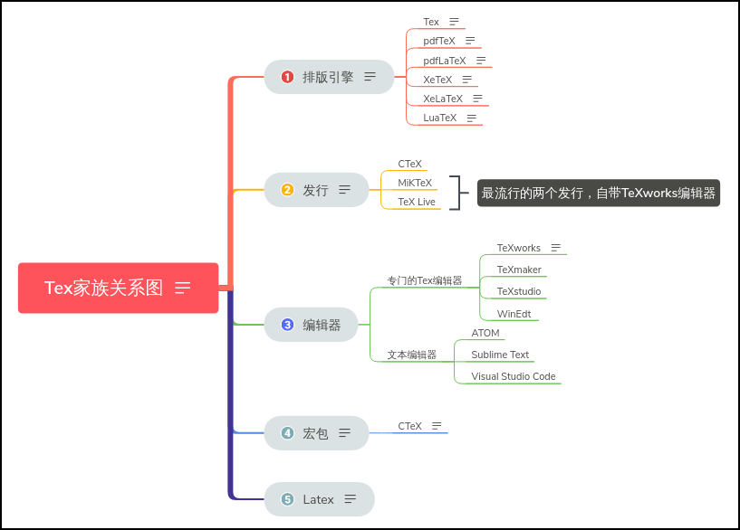
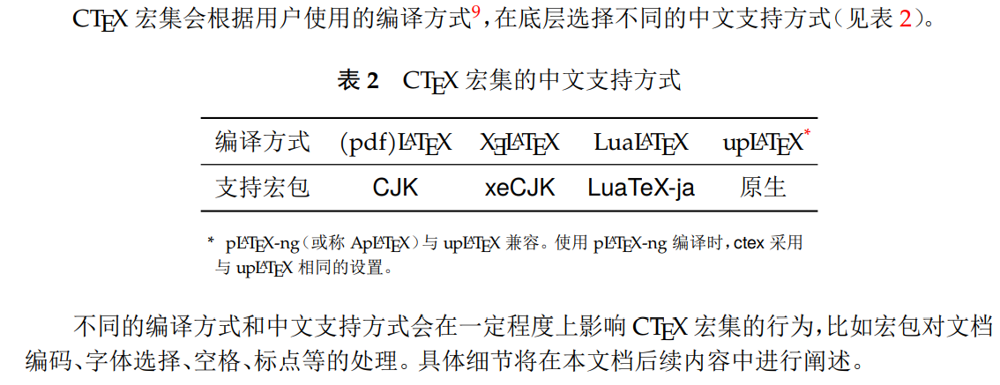

# Latex的介绍
我个人的理解哈，Latex就类似html，先写一堆代码，然后由后台算法引擎渲染和处理之后得到好看的pdf（或者网页）。

# 编辑器
编辑器就是用来编辑代码/文字的，普通的Notepad就可以，只不过Notepad太简陋，很多功能比如代码对其/高亮/自动联想/预览等功能都没有，所有针对Latex有了各种编辑器，甚至网页版的编辑器。其实聚类似python的编辑器PyCharmm和VS Code一样。TeX的编辑器给用户提供了较为方便的交互工具，将一些编译的过程都做成了按钮。如TeXworks，TeXstudio，TeXShop等。

# 编译器
编译器就是把代码翻译和渲染成最终漂亮的排版的一个软件/算法/引擎。比如我正在写的markdown，它需要一个编译器/算法把源代码转化成看起来更漂亮/整齐的格式。比如我自己就可以写一个自己的markdown的编译器，这个编译器接受markdown的源代码，然后开始从头遍历，碰到#就把它渲染成一级标题，碰到*就把它渲染成列表等。遍历结束之后我就成功把markdown的源代码翻译成了漂亮的网页/pdf了。只不过markdown语法规则比较简单。Latex很复杂。没办法，因为Latex的功能太强大，涉及到目录自动生成，参考文献自动生成，图片/表格自动索引，页眉页脚奇偶页自动设置。要实现这么复杂的功能，自然需要复杂的语法，需要强大了编译器。而且随着越来越多新的功能被用户提出，编译器需要每年更新。比如插入emoj表情，比如插入excel表格等，比如支持汉语的各个字体等。


# TEX/LATEX 关系？
LaTeX是基于TeX的一组宏集/函数集，相当于对TeX进行了一次封装。每一个Latex命令最后都会被转化成一行一行的tex命令来执行。LATEX 之于 TEX 类似 HTML+CSS 之于基本的 HTML, 也类似于vim之于vi，也类似于c++之于c，类似于Monai之于PyTorch。Latex增加了一些语法/函数，比如\newcommand等，方便普通用户使用。[最基本的TeX只有300多个命令，短小精悍却晦涩难懂，所以高老爷子对TeX进行了一次封装，然后就出现了包含600多个宏命令的Plain TeX](https://zhuanlan.zhihu.com/p/181557253)。不够还是难用，就有了Latex。

> LaTeX是一种基于上述TeX的排版系统，作者是美国计算机科学家莱斯利·兰伯特(Leslie · Lamport)。在Lamport大佬的一个网站上的第69可以推测出LaTeX怎么来的，1984年，当时他是一个TeX用户，想写一点东西，要用TeX排版这本书又要写一大堆宏/函数，极其不方便（即使高老爷子已经将TeX封装成了Plain TeX），然后他就想 make his macros usable by others with a little extra effort 。然后LaTeX就出现了，可以方便没有排版和程序设计知识的用户也可以充分发挥TeX提供的强大功能。

--From [LaTeX引擎、格式、宏包、发行版大梳理](https://zhuanlan.zhihu.com/p/181557253)


> 用户在命令行敲入 "latex example.tex". 一个跟 "tex" 一模一样只不过叫做 "latex"的程序启动了。它其> 实就是 TeX, LaTeX 和 TeX 其实是同一个程序。在有些系统下 latex 是一个脚本，里面只有几行字。比如我> 的 Linux 版本就是这样：
> ```
> #!/bin/sh
> test -f "`kpsewhich latex.fmt`" || fmtutil --byfmt latex
> exec tex -fmt=latex "$@"
> ```
> TeX 发现自己是用叫做 "latex" 的命令启动的。或者脚本里明显指明了需要"latex"格式，它就去读入一个宏包> 叫做 latex.fmt. 这个文件一般在 $TEXMF/web2c. 以后我们就进入了 LaTeX 的世界，看到了？LaTeX 只是 > TeX 的一种特殊情况(一种“格式”)。

-- From [LaTeX + CJK 到底干了什么?](https://docs.huihoo.com/homepage/shredderyin/tex/tex_cjk.html)


# 各个分支
e-TeX
高老爷子坚持只有自己能改动TeX。1992年，有俩位不喜欢文学编程的人士，意欲推翻旧封建TeX的专制统治，建立NTS(new typesetting system)天国，结局自然是失败了。但其对TeX造成了较强的冲击，具有深刻的历史意义，并留下了Extended-TeX(e-TeX)，导致了TeX作为太上皇被供了起来，后续的TeX引擎大都基于e-TeX开发。

pdfTeX
pdfTeX是TeX排版程序的附加组件，TeX和pdfTeX最大的区别在于TeX输出dvi文件，而pdfTeX直接输出pdf文件。传统TeX是针对印刷的，只生成dvi文件，**它本身并不支持所谓的「交叉引用」** 欲得到pdf文件，则需要dvipdf工具将dvi文件转化为pdf文件（dvipdf历史也很多，在此不多阐述）

LuaTeX
搞pdfTeX那些人搞着搞着不干了，转而开发新的一个引擎LuaTeX去了。LuaTeX是作为带有Lua脚本引擎嵌入的pdfTeX版本。经过开发一段时间后被pdfTeX开发小组采纳后，LuaTeX成功篡位pdfTeX。

XeTeX
无论是TeX还是pdfTeX的字体配置都不太行，Jonathan Kew 在2004年发布了XeTeX以支持Unicode字符集和ATT字体，当然，仅限Mac系统。2006年支持Linux和Windows。2007年纳入了TeX Live和MikTeX发行版。XeTeX并不直接生成pdf，其有俩步骤，第一步生成xdv(Extended DVI)文件（不保存到磁盘），第二步则通过dvipdf或其他工具将xdv转化为pdf文件。**XeTeX 引擎直接支持 Unicode 字符。也就是说现在不使用 CJK 也能排版中日韩文的文档了，并且这种方式要比之前的方式更加优秀。** (https://www.cnblogs.com/wushaogui/p/10353558.html)

**上面的pdfTeX, LuaTex, XeTex都是用于处理Tex源码的。与之对应，也有pdfLaTex, LuaLaTex, XeLaTex分别用于处理LaTex源码。目前用后者的远比前者的多。但是其实后面那3个引擎也是在后台把LaTex源码转成Tex源码之后调用前面的3个引擎，从而实现对应的功能的。**

ConTeXt
ConTeXt则与LaTeX相对，LaTeX屏蔽了TeX的印刷细节，而ConTeXt则采用了一种补充的方法，提供了处理印刷细节的友好接口。

pTeX & upTeX等日系引擎
pTeX(Publish TeX)是日本ASCII公司的大野俊治(Shunji Ohno)和仓泽良一 (Ryoichi Kurasawa)在Unicode时代前为日语量身制定的TeX引擎；

upTeX是pTeX的Unicode版本，增加了UTF-8编码支持；

pTeX-ng
pTeX-ng(pTeX-next generation)旨在成为下一代汉字处理标准的pTeX，由国人Clerk Ma(马起园)开发，由纯C编写。

--From [LaTeX引擎、格式、宏包、发行版大梳理](https://zhuanlan.zhihu.com/p/181557253)

# 宏包
宏包就是别人通过编写宏集造的轮子，我们直接拿来用就可以了。用过python的同学可能知道，我们会用到各种库，如numpy，math，random等等，而LaTeX的宏包就类似python的标准库或者第三方库。
`\usepackage{setspace}` 就类似python的`import numpy`.

# 发行版：
将引擎，格式，宏包，驱动等等东西统统打包到一起就成了发行版，也就是我们一般要安装的东西。



图中，TeX Live和MacTeX是全部打包好的完整LaTeX工具包，相当于一台组装好的台式机，MiKTeX其他都打包了，唯独没有TeX编辑器，相当于缺了显示器的台式机。

# Tex家族关系


--From [Tex家族关系](https://www.cnblogs.com/wushaogui/p/10353558.html)
# Overleaf
发行版一般是下载下来在自己电脑使用的，使用过程中不需要联网。Overleaf是网页版的实现过程。提供了编辑器+编译器。它提供了网页编辑器（包括很多按钮来实现加粗斜体等功能，也有实时预览功能），同时也提供了多种编译器(LaTex, pdfLaTex, XeLaTex, LuaLaTex等)可以选择。


# 吐槽
## LaTex的函数/宏的调用方式过于粗暴

LaTex的函数定义在一个文件后，通过\input或者\include可以把这个文件导入到另一个文件，从而使得另一个文件可以使用这个文件定义的函数。这就类似于from numpy import *。 导入的文件如果定义了太多函数，自己是不清楚哪个函数是属于哪个文件的。尤其是在看别人的代码的似乎，直接开始调用一个函数，但是最开始导入了那么多别人写的包和自己自定义的函数/包/宏，谁知道这个函数/命令来自哪里？！尤其是overleaf还没有全局搜索（的确没有！）功能，要花很久才能找到某个陌生的命令/函数的定义，从而得知它的功能。

## 报错不够详细，我总是定位不到问题所在
其实这个问题和LaTex引用包过于粗暴有关，直接引用了包里所有的函数/命令，现在提示`\makecolophon`命令似乎已经被2个包定义过了，因此报错了，我怎么知道这个命令到底是来自哪个包……（后来我注释掉这句话就不报错了）。

后来又提示：“LaTeX Error: Command \printglossary already defined.

Or name \end... illegal, see p.192 of the manual.

See the LaTeX manual or LaTeX Companion for explanation.
Type  H <return>  for immediate help.
 ...                                              
                                                  
l.116 ...mmand\printglossary{\@input@{\jobname.gls}}
                                                  
Your command was ignored.
Type  I <command> <return>  to replace it with another command,
or  <return>  to continue without it.”

我全局搜索也没有在我的项目中搜索到\printglossary命令……猜测可能是其他包里有这个命令，冲突了吧。可是我怎么解决呢？我不知道……LaTeX的debug太差劲了，错误提示太模糊了，而且包的管理太差劲了。直接导入了包的所有命令，这就非常容易造成命名冲突啊！还是python好！

## 对中文的支持
我想在全是英文的大论文里插入几行中文，但是直接插入后并没法显示。于是我花了很久的时间来解决这个问题。

方法1： `ctex`
```
\usepackage[UTF8,noindent]{ctex}
\renewcommand{\contentsname}{Contents}      % 将“目录”改为“Contents”
\renewcommand{\bibname}{Bibliography}       % 将“参考文献”改为“Bibliography”（用于 book 类型文档）
\renewcommand{\appendixname}{Appendix}
\renewcommand{\figurename}{Figure}
\renewcommand{\tablename}{Table}
```

`\usepackage[UTF8,noindent]{ctex}` 不仅支持了中文，而且把目录、参考文献、图、表等常用关键词也给变成了中文，这就是为什么我在上面要加一些命令给替换回去。但是这还不够，因为我发现它过于智能，竟然把段落的缩进也都调整成首行缩进了。但是其实原本默认的英文文档里，每个章节下的首段是不缩进的。我目前没有想好有这么办法解决这个问题。我查了很久资料。我只想支持中文的显示，不想改动其他地方的排版和文字，怎么就这么难啊？！

方法2：新版`ctex`宏集可以做到「[只提供中文支持，不改变版式风格](https://liam.page/2015/05/16/ctex-20-released/)」。只需要这样：
`\usepackage[scheme = plain]{ctex} .不过我发现虽然这样能显示了，但是pdfLaTex编译器是不行的，必须得用XeLaTex或者LuaLaTex。而且编译过程中会有报错。

# CTeX
## CTeX宏集的介绍
它在LaTeX的基础上增加了对中文的支持。
> 最初，Knuth 在设计开发 TEX 的时候没有考虑到多国文字支持，特别是对多字节的中日韩
表意文字的支持。这使得 TEX 以至后来的 LATEX 对中文的支持一直不是很好。即使在 CJK 宏
包解决了中文字符处理的问题以后，中文用户使用 LATEX 仍然要面对许多困难。这些困难里，
以章节标题的中文化为最。由于中文和西文书写习惯的差异，用户很难使用标准文档类中的代
码结构来表达中文标题。于是，用户不得不对标准文档类做较大的修改。除此之外，日期格式、
首行缩进、中文字号和字距等细节问题，也需要精细的调校。我们设计 CTEX 宏集的目的之一
就是解决这些 LATEX 文档的汉化难题。
-- From [CTEX 宏集手册](https://mirrors.ibiblio.org/CTAN/language/chinese/ctex/ctex.pdf)

## CTxX的安装方法？Latex如何安装新的宏包/宏集？
类似python的pip，tex有tlmgr。所以，安装ctex宏集，就是`tlmgr install ctex`。类似于`pip install monai`。`monai`在pytorch的基础上增加了对医学影像的支持，而`ctex`在latex的基础上增加了对中文的支持。

# CTeX的编译方式


-- From [CTEX 宏集手册](https://mirrors.ibiblio.org/CTAN/language/chinese/ctex/ctex.pdf)


